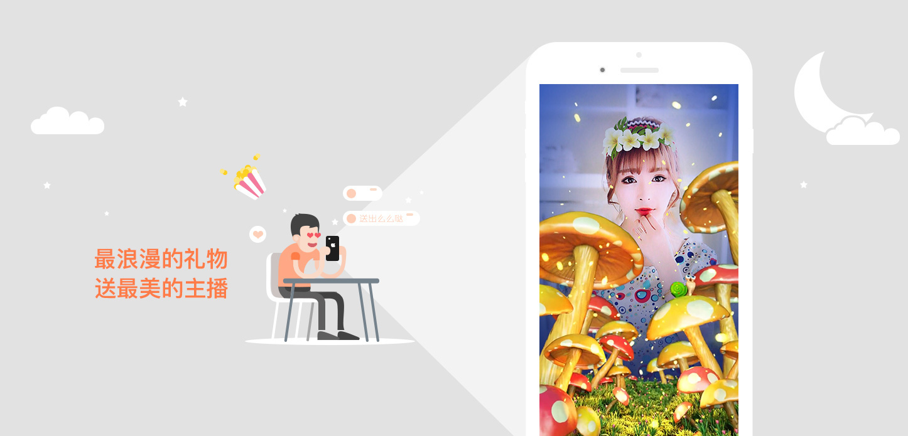

# AiyaEffectsSDK Android User's Guide 

See [Chinese Document](readme_en.md)

## 1. Summary
AiyaEffectsSDK is a high-performance rendering solution about dynamic stickers and animation effects which based on the independent research and development of face recognition module and it can be used to Android/iOS , two platforms.

### 1.1 Version Info

**Current Version：AiyaEffects SDK V4.0.8** [version history](https://github.com/aiyaapp/AiyaEffectsAndroid/wiki/VersionHistory)

### 1.2 Integration Examples
* [AiyaEffectsSDK with KSVC Demo](https://github.com/aiyaapp/AiyaEffectsWithKSVCAndroid)

## 2. SDK Function Declaration

- provide 2D sequence frame effect
- face mask effect
- 3D static/animation effects 
- a variety of beauty algorithm 

## 3. Runtime Environment
AiyaEffectsSDK minSdkVersion 19(Android4.4+).

## 4. Get SDK
There are two ways to get out sdk:

* [Download from github](https://github.com/aiyaapp/AiyaEffectsAndroid)

## 5. Rapid Integration
Plese refer to our [rapid integration document](doc/integrated_en.md)

## 6. User-Defined Stickers And Animations
The document of user-defined stickers and animations is not officially opened yet.If you need to design stickers/animations by youself,please [contact us](http://www.bbtexiao.com/site/about) to get the document.

## 7. License
* AiyaEffectsSDK can be used in commercial applications.
* Get appKey please visit [AiyaEffects For Free](http://bbtexiao.aiyaapp.com/site/free)

## 8. Feedback And Suggest
- Homepage: [AiyaEffects](http://www.bbtexiao.com)

